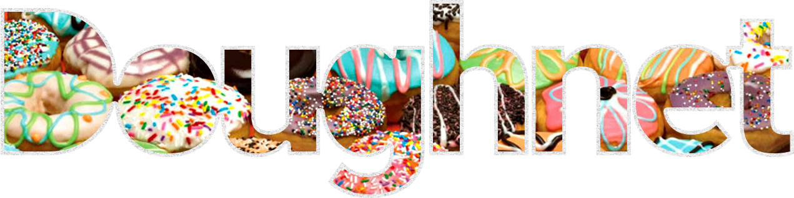

 

#### Financial Wellness for All.

## Introduction
#### What is the MEAN Blueprint?
Primary repository for Doughnet Financial™ codebase. 

## The Technical
#### Getting Started

## Usage
TODO

## Mumbo-Jumbo™
TODO

